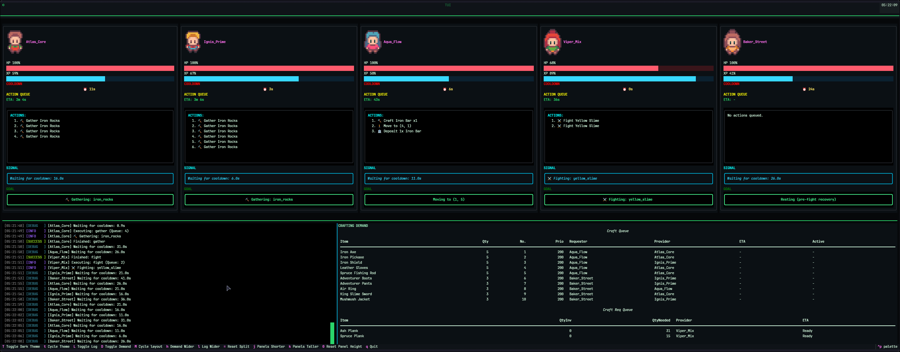
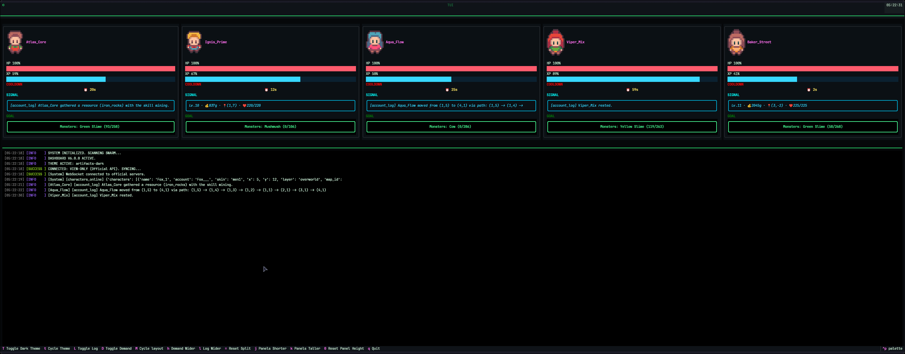

# Sentient Artifacts TUI


A real-time terminal dashboard for [Artifacts MMO](https://artifactsmmo.com),
built with [Textual](https://textual.textualize.io/).

The bot that drives my swarm is private, but **you don't need it**.  
The TUI ships with an **Official API mode** that connects directly to the
Artifacts MMO API using your game token - giving you a live, view-only TUI
dashboard for all your characters.

## Screenshots

### Bot Manager Mode

Full control with action queues, crafting demand panel, and bot commands.



### Official API Mode (View-Only)

Compact cards with live WebSocket events — no bot manager required.



## Features

| Feature | Official API | Bot Manager |
|---|---|---|
| Live character cards (HP, XP, cooldown, position) | ✅ | ✅ |
| Real-time WebSocket events (GE trades, achievements, spawns) | ✅ | ✅ |
| SIGNAL status line | ✅ | ✅ |
| Action queue display | — | ✅ |
| Crafting demand panel | — | ✅ |
| Bot commands | — | ✅ |

## Requirements

- **Python 3.12+**
- **[uv](https://docs.astral.sh/uv/)** (recommended) or pip

## Installation

```bash
# Clone the repository
git clone https://github.com/JaINTP/artifacts-tui.git
cd artifacts-tui

# Install dependencies with uv
uv sync
```

## Configuration

Copy the example environment file and fill in your credentials:

```bash
cp .env.example .env
```

### Environment Variables

| Variable | Required | Description |
|---|---|---|
| `ARTIFACTS_TOKEN` | Yes (if no bot manager) | Your Artifacts MMO API token. Enables view-only mode via the official API. Obtain one from the [Artifacts MMO dashboard](https://artifactsmmo.com). |
| `BOT_MANAGER_URL` | No | Base URL for a running Bot Manager API (e.g. `http://localhost:8765`). When set, the TUI connects to the bot manager instead and unlocks commands, action queues, and the demand panel. |

> [!NOTE]
> When **both** variables are set, the bot manager takes priority and the
> token is ignored.

## Usage

### View-Only Mode (Official API)

The quickest way to try the TUI - just your game token:

```bash
# Via .env (recommended)
echo "ARTIFACTS_TOKEN=your_token_here" > .env
uv run sentient-tui

# Or pass the token directly
uv run sentient-tui --token YOUR_GAME_TOKEN
```

### Bot Manager Mode

If you are running a compatible bot manager:

```bash
uv run sentient-tui --url http://localhost:8765
```

### Keyboard Shortcuts

| Key | Action |
|---|---|
| `M` | Cycle layout mode |
| `L` | Toggle log console |
| `D` | Toggle demand panel (bot manager only) |
| `T` / `t` | Toggle dark theme / cycle themes |
| `j` / `k` | Panels shorter / taller |
| `h` / `l` | Demand wider / log wider (bot manager only) |
| `=` | Reset panel split |
| `0` | Reset panel height |
| `q` | Quit |

## Sprite Rendering

Character sprites are rendered directly in the terminal using
[textual-image](https://github.com/lnqs/textual-image). The library
auto-detects the best rendering protocol available:

| Protocol | Quality | Supported Terminals |
|---|---|---|
| **Kitty TGP** | Best | Kitty, Konsole, WezTerm |
| **Sixel** | Good | iTerm2, foot, WezTerm, Konsole, VS Code, Windows Terminal, xterm, Black Box |
| **Half-cell Unicode** | Fallback | All terminals (automatic fallback) |

> [!TIP]
> For the best sprite quality, use a terminal that supports the Kitty
> graphics protocol or Sixel. GNOME Terminal and Warp do not currently
> support either protocol and will use the Unicode fallback.

## Development

```bash
# Install with dev dependencies
uv sync --group dev

# Run tests
uv run pytest
```

## Notes

- Sprites live in `skins/` at the repo root.
- The bot manager API server is part of a separate, private repository.
  The TUI works standalone via the official API.
